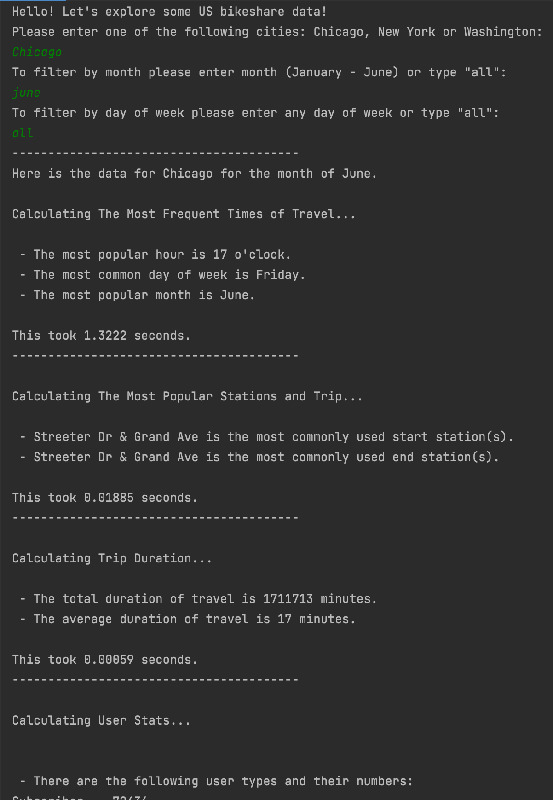

### Date created
December 18, 2021

### Project Title
BikeShare

### Description
Computes descriptive statistics to explore data related to bike share systems for Chicago, New York City, and Washington by responding to questions.

### Files used
bikes.py
chicago.csv
new_york_city.csv
washington.csv
